# AFAD ソケット連携システム - 可視化ドキュメント

**作成日:** 2025-10-29
**対象:** 詳細設計_AFADソケット連携システム.md v2.2

このドキュメントは、AFAD ソケット連携システムの全体像を可視化したものです。
各図は Mermaid 記法で記述されており、GitHub や対応エディタで自動レンダリングされます。

---

## 目次

1. [システム全体アーキテクチャ](#1-システム全体アーキテクチャ)
2. [コンポーネント依存関係図](#2-コンポーネント依存関係図)
3. [データフロー：コンバージョン発生時](#3-データフローコンバージョン発生時)
4. [データフロー：広告更新時（AFAD → CATS）](#4-データフロー広告更新時afad--cats)
5. [エラーハンドリングフロー](#5-エラーハンドリングフロー)
6. [クラス図：CATS側コンポーネント](#6-クラス図cats側コンポーネント)
7. [クラス図：Gateway側コンポーネント](#7-クラス図gateway側コンポーネント)
8. [イベントタイプフロー](#8-イベントタイプフロー)
9. [データベース関係図](#9-データベース関係図)
10. [デプロイメント構成図](#10-デプロイメント構成図)
11. [シーケンス図：WebSocket接続確立](#11-シーケンス図websocket接続確立)
12. [シーケンス図：キュー処理とリトライ](#12-シーケンス図キュー処理とリトライ)

---

## 1. システム全体アーキテクチャ

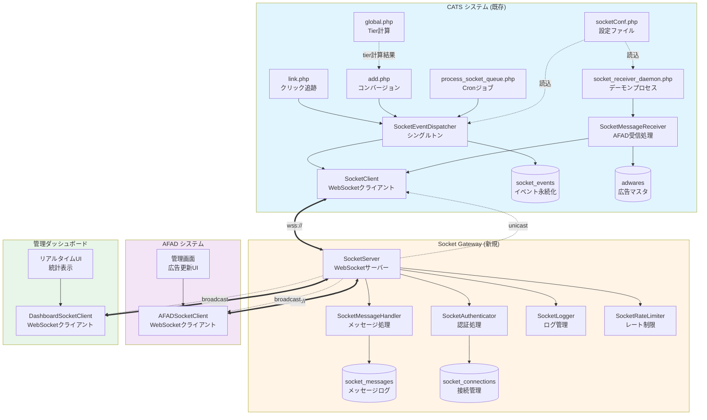
```mermaid
graph TB
    subgraph CATS["CATS システム (既存)"]
        Link[link.php<br/>クリック追跡]
        Add[add.php<br/>コンバージョン]
        Global[global.php<br/>Tier計算]

        Link --> Dispatcher[SocketEventDispatcher<br/>シングルトン]
        Add --> Dispatcher
        Global -.tier計算結果.-> Add

        Dispatcher --> Client[SocketClient<br/>WebSocketクライアント]
        Dispatcher --> DB1[(socket_events<br/>イベント永続化)]

        Receiver[SocketMessageReceiver<br/>AFAD受信処理] --> Client
        Receiver --> DB2[(adwares<br/>広告マスタ)]

        Daemon[socket_receiver_daemon.php<br/>デーモンプロセス] --> Receiver
        Cron[process_socket_queue.php<br/>Cronジョブ] --> Dispatcher

        Config[socketConf.php<br/>設定ファイル] -.読込.-> Dispatcher
        Config -.読込.-> Daemon
    end

    subgraph Gateway["Socket Gateway (新規)"]
        Server[SocketServer<br/>WebSocketサーバー]
        Handler[SocketMessageHandler<br/>メッセージ処理]
        Auth[SocketAuthenticator<br/>認証処理]
        Logger[SocketLogger<br/>ログ管理]
        Limiter[SocketRateLimiter<br/>レート制限]

        Server --> Handler
        Server --> Auth
        Server --> Logger
        Server --> Limiter

        Handler --> DB3[(socket_messages<br/>メッセージログ)]
        Auth --> DB4[(socket_connections<br/>接続管理)]
    end

    subgraph AFAD["AFAD システム"]
        AFADClient[AFADSocketClient<br/>WebSocketクライアント]
        AFADDash[管理画面<br/>広告更新UI]

        AFADDash --> AFADClient
    end

    subgraph Dashboard["管理ダッシュボード"]
        DashClient[DashboardSocketClient<br/>WebSocketクライアント]
        UI[リアルタイムUI<br/>統計表示]

        UI --> DashClient
    end

    Client <==>|wss://| Server
    AFADClient <==>|wss://| Server
    DashClient <==>|wss://| Server

    Server -.broadcast.-> AFADClient
    Server -.broadcast.-> DashClient
    Server -.unicast.-> Client

    style CATS fill:#e1f5ff
    style Gateway fill:#fff4e6
    style AFAD fill:#f3e5f5
    style Dashboard fill:#e8f5e9
```

---

## 2. コンポーネント依存関係図

### 2.1 CATS側依存関係

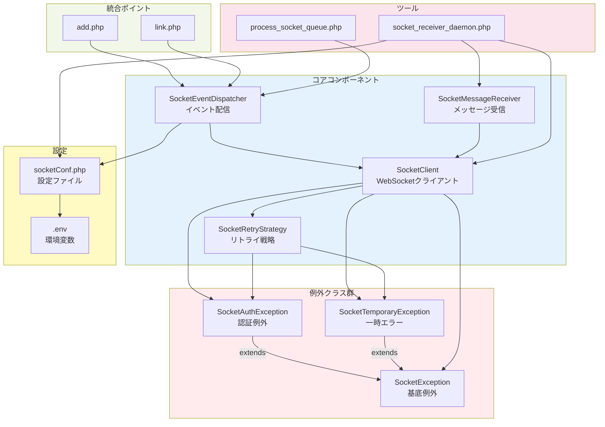
```mermaid
graph TD
    subgraph Exception["例外クラス群"]
        SE[SocketException<br/>基底例外]
        SAE[SocketAuthException<br/>認証例外]
        STE[SocketTemporaryException<br/>一時エラー]

        SAE -->|extends| SE
        STE -->|extends| SE
    end

    subgraph Core["コアコンポーネント"]
        SC[SocketClient<br/>WebSocketクライアント]
        SED[SocketEventDispatcher<br/>イベント配信]
        SMR[SocketMessageReceiver<br/>メッセージ受信]
        SRS[SocketRetryStrategy<br/>リトライ戦略]
    end

    subgraph Config["設定"]
        Conf[socketConf.php<br/>設定ファイル]
        Env[.env<br/>環境変数]
    end

    subgraph Integration["統合ポイント"]
        Add[add.php]
        Link[link.php]
    end

    subgraph Tools["ツール"]
        Queue[process_socket_queue.php]
        Daemon[socket_receiver_daemon.php]
    end

    SC --> SE
    SC --> STE
    SC --> SAE
    SC --> SRS

    SED --> SC
    SED --> Conf

    SMR --> SC

    SRS --> SAE
    SRS --> STE

    Add --> SED
    Link --> SED

    Queue --> SED
    Daemon --> SMR
    Daemon --> SC
    Daemon --> Conf

    Conf --> Env

    style Exception fill:#ffebee
    style Core fill:#e3f2fd
    style Config fill:#fff9c4
    style Integration fill:#f1f8e9
    style Tools fill:#fce4ec
```

### 2.2 Gateway側依存関係

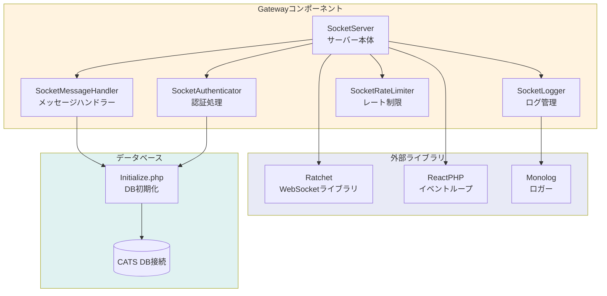
```mermaid
graph TD
    subgraph Ratchet["外部ライブラリ"]
        R[Ratchet<br/>WebSocketライブラリ]
        React[ReactPHP<br/>イベントループ]
        Monolog[Monolog<br/>ロガー]
    end

    subgraph Gateway["Gatewayコンポーネント"]
        SS[SocketServer<br/>サーバー本体]
        SMH[SocketMessageHandler<br/>メッセージハンドラー]
        SA[SocketAuthenticator<br/>認証処理]
        SL[SocketLogger<br/>ログ管理]
        SRL[SocketRateLimiter<br/>レート制限]
    end

    subgraph DB["データベース"]
        Init[Initialize.php<br/>DB初期化]
        DBConn[(CATS DB接続)]
    end

    SS --> R
    SS --> React
    SS --> SMH
    SS --> SA
    SS --> SL
    SS --> SRL

    SL --> Monolog

    SMH --> Init
    SA --> Init
    Init --> DBConn

    style Ratchet fill:#e8eaf6
    style Gateway fill:#fff3e0
    style DB fill:#e0f2f1
```

---

## 3. データフロー：コンバージョン発生時

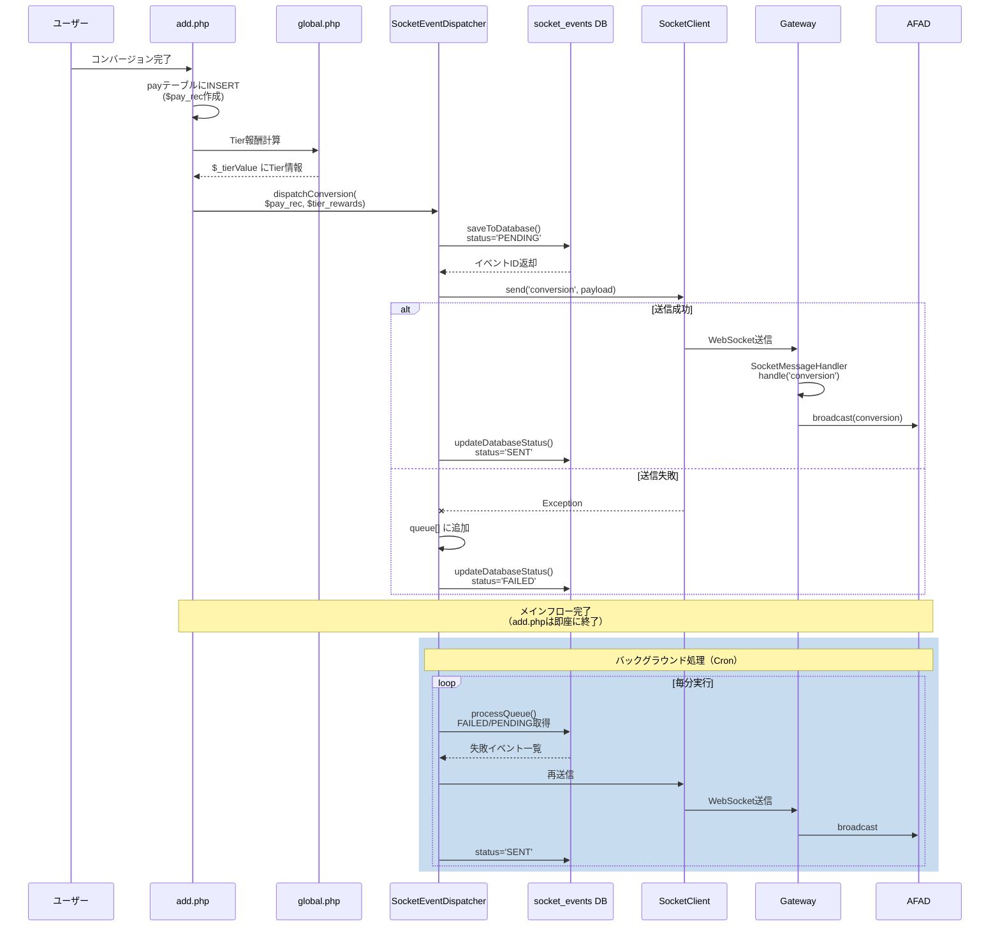
```mermaid
sequenceDiagram
    participant User as ユーザー
    participant Add as add.php
    participant Global as global.php
    participant Disp as SocketEventDispatcher
    participant DB as socket_events DB
    participant Client as SocketClient
    participant GW as Gateway
    participant AFAD as AFAD

    User->>Add: コンバージョン完了
    Add->>Add: payテーブルにINSERT<br/>($pay_rec作成)
    Add->>Global: Tier報酬計算
    Global-->>Add: $_tierValue にTier情報

    Add->>Disp: dispatchConversion(<br/>$pay_rec, $tier_rewards)

    Disp->>DB: saveToDatabase()<br/>status='PENDING'
    DB-->>Disp: イベントID返却

    Disp->>Client: send('conversion', payload)

    alt 送信成功
        Client->>GW: WebSocket送信
        GW->>GW: SocketMessageHandler<br/>handle('conversion')
        GW->>AFAD: broadcast(conversion)
        Disp->>DB: updateDatabaseStatus()<br/>status='SENT'
    else 送信失敗
        Client--xDisp: Exception
        Disp->>Disp: queue[] に追加
        Disp->>DB: updateDatabaseStatus()<br/>status='FAILED'
    end

    Note over Add,AFAD: メインフロー完了<br/>（add.phpは即座に終了）

    rect rgb(200, 220, 240)
        Note over Disp,AFAD: バックグラウンド処理（Cron）
        loop 毎分実行
            Disp->>DB: processQueue()<br/>FAILED/PENDING取得
            DB-->>Disp: 失敗イベント一覧
            Disp->>Client: 再送信
            Client->>GW: WebSocket送信
            GW->>AFAD: broadcast
            Disp->>DB: status='SENT'
        end
    end
```

---

## 4. データフロー：広告更新時（AFAD → CATS）

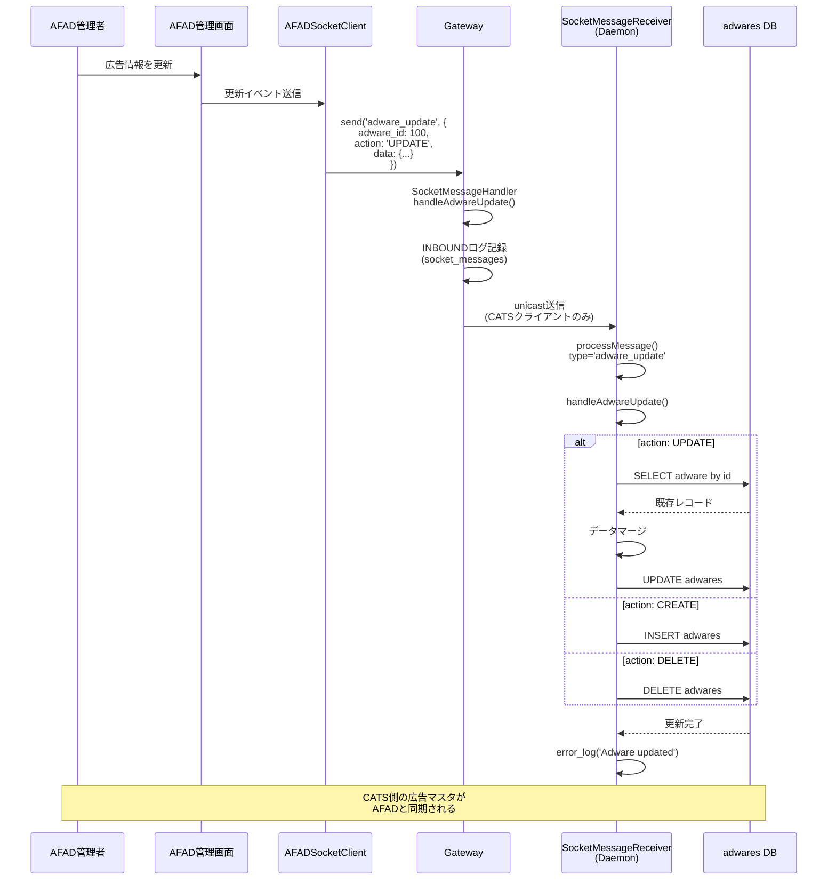
```mermaid
sequenceDiagram
    participant Admin as AFAD管理者
    participant UI as AFAD管理画面
    participant AC as AFADSocketClient
    participant GW as Gateway
    participant RC as SocketMessageReceiver<br/>(Daemon)
    participant DB as adwares DB

    Admin->>UI: 広告情報を更新
    UI->>AC: 更新イベント送信

    AC->>GW: send('adware_update', {<br/>  adware_id: 100,<br/>  action: 'UPDATE',<br/>  data: {...}<br/>})

    GW->>GW: SocketMessageHandler<br/>handleAdwareUpdate()
    GW->>GW: INBOUNDログ記録<br/>(socket_messages)

    GW->>RC: unicast送信<br/>(CATSクライアントのみ)

    RC->>RC: processMessage()<br/>type='adware_update'
    RC->>RC: handleAdwareUpdate()

    alt action: UPDATE
        RC->>DB: SELECT adware by id
        DB-->>RC: 既存レコード
        RC->>RC: データマージ
        RC->>DB: UPDATE adwares
    else action: CREATE
        RC->>DB: INSERT adwares
    else action: DELETE
        RC->>DB: DELETE adwares
    end

    DB-->>RC: 更新完了
    RC->>RC: error_log('Adware updated')

    Note over Admin,DB: CATS側の広告マスタが<br/>AFADと同期される
```

---

## 5. エラーハンドリングフロー

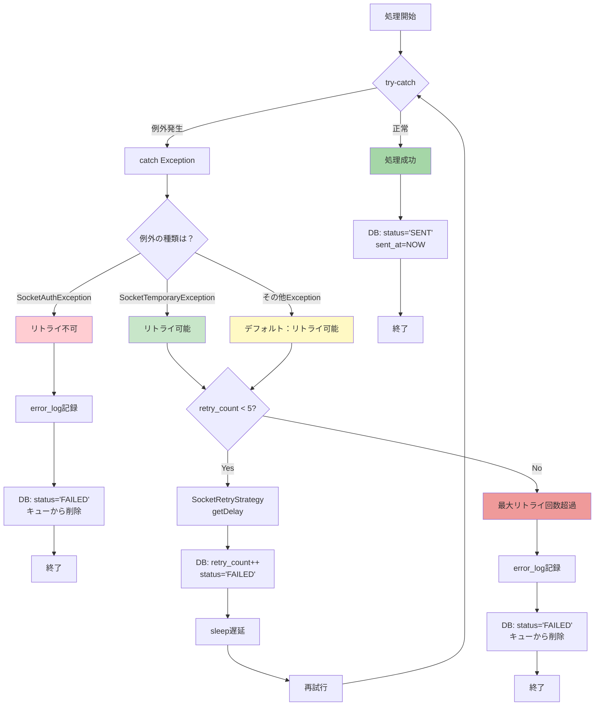
```mermaid
graph TD
    Start[処理開始] --> Try{try-catch}

    Try -->|正常| Success[処理成功]
    Try -->|例外発生| Catch[catch Exception]

    Catch --> CheckType{例外の種類は？}

    CheckType -->|SocketAuthException| NoRetry[リトライ不可]
    CheckType -->|SocketTemporaryException| CanRetry[リトライ可能]
    CheckType -->|その他Exception| DefaultRetry[デフォルト：リトライ可能]

    NoRetry --> LogError1[error_log記録]
    LogError1 --> DBFailed1[DB: status='FAILED'<br/>キューから削除]
    DBFailed1 --> End1[終了]

    CanRetry --> CheckCount{retry_count < 5?}
    DefaultRetry --> CheckCount

    CheckCount -->|Yes| CalcDelay[SocketRetryStrategy<br/>getDelay]
    CalcDelay --> IncrementRetry[DB: retry_count++<br/>status='FAILED']
    IncrementRetry --> Sleep[sleep遅延]
    Sleep --> Retry[再試行]
    Retry --> Try

    CheckCount -->|No| MaxRetry[最大リトライ回数超過]
    MaxRetry --> LogError2[error_log記録]
    LogError2 --> DBFailed2[DB: status='FAILED'<br/>キューから削除]
    DBFailed2 --> End2[終了]

    Success --> DBSuccess[DB: status='SENT'<br/>sent_at=NOW]
    DBSuccess --> End3[終了]

    style NoRetry fill:#ffcdd2
    style CanRetry fill:#c8e6c9
    style DefaultRetry fill:#fff9c4
    style Success fill:#a5d6a7
    style MaxRetry fill:#ef9a9a
```

### リトライ遅延計算

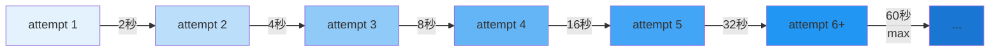
```mermaid
graph LR
    A[attempt 1] -->|2秒| B[attempt 2]
    B -->|4秒| C[attempt 3]
    C -->|8秒| D[attempt 4]
    D -->|16秒| E[attempt 5]
    E -->|32秒| F[attempt 6+]
    F -->|60秒<br/>max| G[...]

    style A fill:#e3f2fd
    style B fill:#bbdefb
    style C fill:#90caf9
    style D fill:#64b5f6
    style E fill:#42a5f5
    style F fill:#2196f3
    style G fill:#1976d2
```

**計算式:**
- Base: 2秒
- Formula: `min(2 * 2^(attempt-1), 60)`
- Jitter: ±20% ランダム

---

## 6. クラス図：CATS側コンポーネント

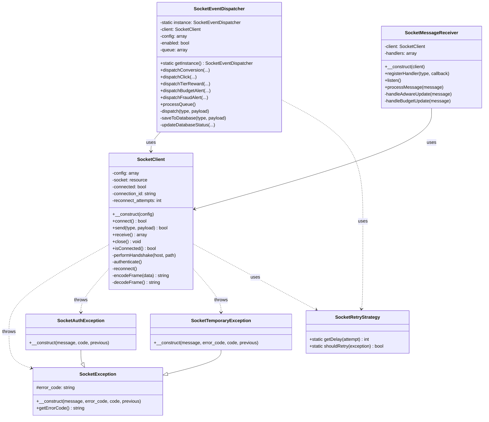
```mermaid
classDiagram
    class SocketException {
        #error_code: string
        +__construct(message, error_code, code, previous)
        +getErrorCode() string
    }

    class SocketAuthException {
        +__construct(message, code, previous)
    }

    class SocketTemporaryException {
        +__construct(message, error_code, code, previous)
    }

    class SocketClient {
        -config: array
        -socket: resource
        -connected: bool
        -connection_id: string
        -reconnect_attempts: int
        +__construct(config)
        +connect() bool
        +send(type, payload) bool
        +receive() array
        +close() void
        +isConnected() bool
        -performHandshake(host, path)
        -authenticate()
        -reconnect()
        -encodeFrame(data) string
        -decodeFrame() string
    }

    class SocketEventDispatcher {
        -static instance: SocketEventDispatcher
        -client: SocketClient
        -config: array
        -enabled: bool
        -queue: array
        +static getInstance() SocketEventDispatcher
        +dispatchConversion(...)
        +dispatchClick(...)
        +dispatchTierReward(...)
        +dispatchBudgetAlert(...)
        +dispatchFraudAlert(...)
        +processQueue()
        -dispatch(type, payload)
        -saveToDatabase(type, payload)
        -updateDatabaseStatus(...)
    }

    class SocketMessageReceiver {
        -client: SocketClient
        -handlers: array
        +__construct(client)
        +registerHandler(type, callback)
        +listen()
        +processMessage(message)
        -handleAdwareUpdate(message)
        -handleBudgetUpdate(message)
    }

    class SocketRetryStrategy {
        +static getDelay(attempt) int
        +static shouldRetry(exception) bool
    }

    SocketAuthException --|> SocketException
    SocketTemporaryException --|> SocketException

    SocketClient ..> SocketException : throws
    SocketClient ..> SocketAuthException : throws
    SocketClient ..> SocketTemporaryException : throws
    SocketClient ..> SocketRetryStrategy : uses

    SocketEventDispatcher --> SocketClient : uses
    SocketEventDispatcher ..> SocketRetryStrategy : uses

    SocketMessageReceiver --> SocketClient : uses
```

---

## 7. クラス図：Gateway側コンポーネント

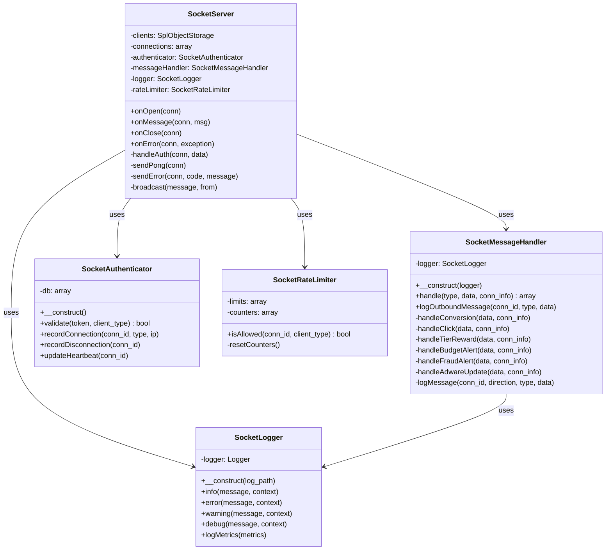
```mermaid
classDiagram
    class SocketServer {
        -clients: SplObjectStorage
        -connections: array
        -authenticator: SocketAuthenticator
        -messageHandler: SocketMessageHandler
        -logger: SocketLogger
        -rateLimiter: SocketRateLimiter
        +onOpen(conn)
        +onMessage(conn, msg)
        +onClose(conn)
        +onError(conn, exception)
        -handleAuth(conn, data)
        -sendPong(conn)
        -sendError(conn, code, message)
        -broadcast(message, from)
    }

    class SocketMessageHandler {
        -logger: SocketLogger
        +__construct(logger)
        +handle(type, data, conn_info) array
        +logOutboundMessage(conn_id, type, data)
        -handleConversion(data, conn_info)
        -handleClick(data, conn_info)
        -handleTierReward(data, conn_info)
        -handleBudgetAlert(data, conn_info)
        -handleFraudAlert(data, conn_info)
        -handleAdwareUpdate(data, conn_info)
        -logMessage(conn_id, direction, type, data)
    }

    class SocketAuthenticator {
        -db: array
        +__construct()
        +validate(token, client_type) bool
        +recordConnection(conn_id, type, ip)
        +recordDisconnection(conn_id)
        +updateHeartbeat(conn_id)
    }

    class SocketLogger {
        -logger: Logger
        +__construct(log_path)
        +info(message, context)
        +error(message, context)
        +warning(message, context)
        +debug(message, context)
        +logMetrics(metrics)
    }

    class SocketRateLimiter {
        -limits: array
        -counters: array
        +isAllowed(conn_id, client_type) bool
        -resetCounters()
    }

    SocketServer --> SocketMessageHandler : uses
    SocketServer --> SocketAuthenticator : uses
    SocketServer --> SocketLogger : uses
    SocketServer --> SocketRateLimiter : uses

    SocketMessageHandler --> SocketLogger : uses
```

---

## 8. イベントタイプフロー

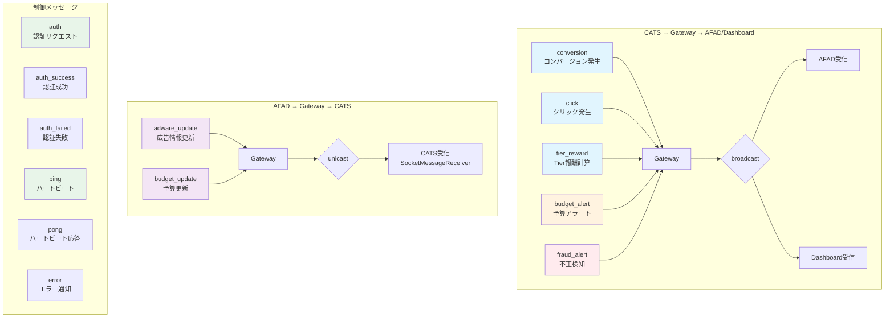
```mermaid
graph TB
    subgraph CATS_Events["CATS → Gateway → AFAD/Dashboard"]
        Conv[conversion<br/>コンバージョン発生] --> GW1[Gateway]
        Click[click<br/>クリック発生] --> GW1
        Tier[tier_reward<br/>Tier報酬計算] --> GW1
        Budget[budget_alert<br/>予算アラート] --> GW1
        Fraud[fraud_alert<br/>不正検知] --> GW1

        GW1 --> BC1{broadcast}
        BC1 --> AFAD1[AFAD受信]
        BC1 --> Dash1[Dashboard受信]
    end

    subgraph AFAD_Events["AFAD → Gateway → CATS"]
        AdUpdate[adware_update<br/>広告情報更新] --> GW2[Gateway]
        BudgetUpdate[budget_update<br/>予算更新] --> GW2

        GW2 --> UC{unicast}
        UC --> CATS1[CATS受信<br/>SocketMessageReceiver]
    end

    subgraph Control["制御メッセージ"]
        Auth[auth<br/>認証リクエスト]
        AuthOK[auth_success<br/>認証成功]
        AuthNG[auth_failed<br/>認証失敗]
        Ping[ping<br/>ハートビート]
        Pong[pong<br/>ハートビート応答]
        Error[error<br/>エラー通知]
    end

    style Conv fill:#e1f5fe
    style Click fill:#e1f5fe
    style Tier fill:#e1f5fe
    style Budget fill:#fff3e0
    style Fraud fill:#ffebee
    style AdUpdate fill:#f3e5f5
    style BudgetUpdate fill:#f3e5f5
    style Auth fill:#e8f5e9
    style Ping fill:#e8f5e9
```

### イベントタイプ一覧マトリクス

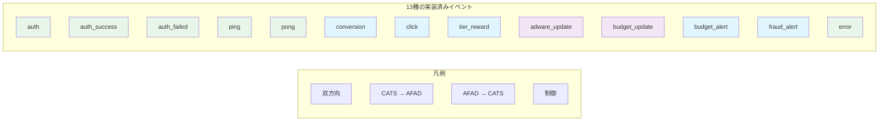
```mermaid
graph LR
    subgraph Legend["凡例"]
        BI[双方向]
        CATS_TO[CATS → AFAD]
        AFAD_TO[AFAD → CATS]
        CTRL[制御]
    end

    subgraph Types["13種の実装済みイベント"]
        T1[auth]
        T2[auth_success]
        T3[auth_failed]
        T4[ping]
        T5[pong]
        T6[conversion]
        T7[click]
        T8[tier_reward]
        T9[adware_update]
        T10[budget_update]
        T11[budget_alert]
        T12[fraud_alert]
        T13[error]
    end

    style T1 fill:#e8f5e9
    style T2 fill:#e8f5e9
    style T3 fill:#e8f5e9
    style T4 fill:#e8f5e9
    style T5 fill:#e8f5e9
    style T13 fill:#e8f5e9

    style T6 fill:#e1f5fe
    style T7 fill:#e1f5fe
    style T8 fill:#e1f5fe
    style T11 fill:#e1f5fe
    style T12 fill:#e1f5fe

    style T9 fill:#f3e5f5
    style T10 fill:#f3e5f5
```

---

## 9. データベース関係図

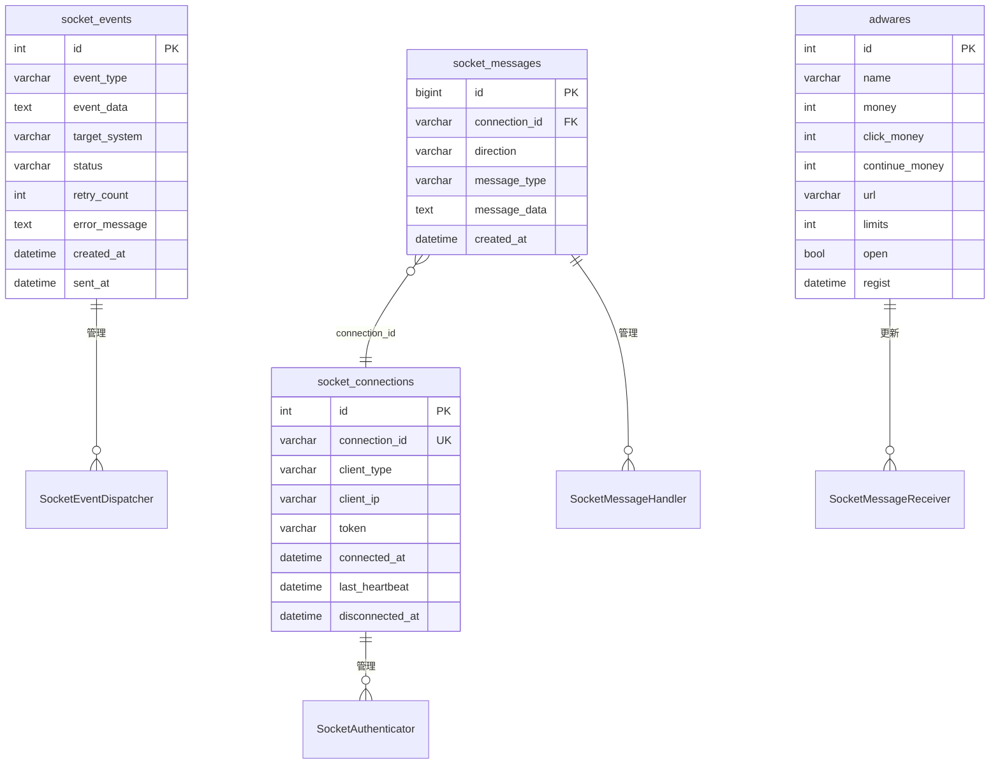
```mermaid
erDiagram
    socket_events ||--o{ SocketEventDispatcher : "管理"
    socket_connections ||--o{ SocketAuthenticator : "管理"
    socket_messages ||--o{ SocketMessageHandler : "管理"
    adwares ||--o{ SocketMessageReceiver : "更新"

    socket_events {
        int id PK
        varchar event_type
        text event_data
        varchar target_system
        varchar status
        int retry_count
        text error_message
        datetime created_at
        datetime sent_at
    }

    socket_connections {
        int id PK
        varchar connection_id UK
        varchar client_type
        varchar client_ip
        varchar token
        datetime connected_at
        datetime last_heartbeat
        datetime disconnected_at
    }

    socket_messages {
        bigint id PK
        varchar connection_id FK
        varchar direction
        varchar message_type
        text message_data
        datetime created_at
    }

    adwares {
        int id PK
        varchar name
        int money
        int click_money
        int continue_money
        varchar url
        int limits
        bool open
        datetime regist
    }

    socket_messages }o--|| socket_connections : "connection_id"
```

### テーブル使用状況

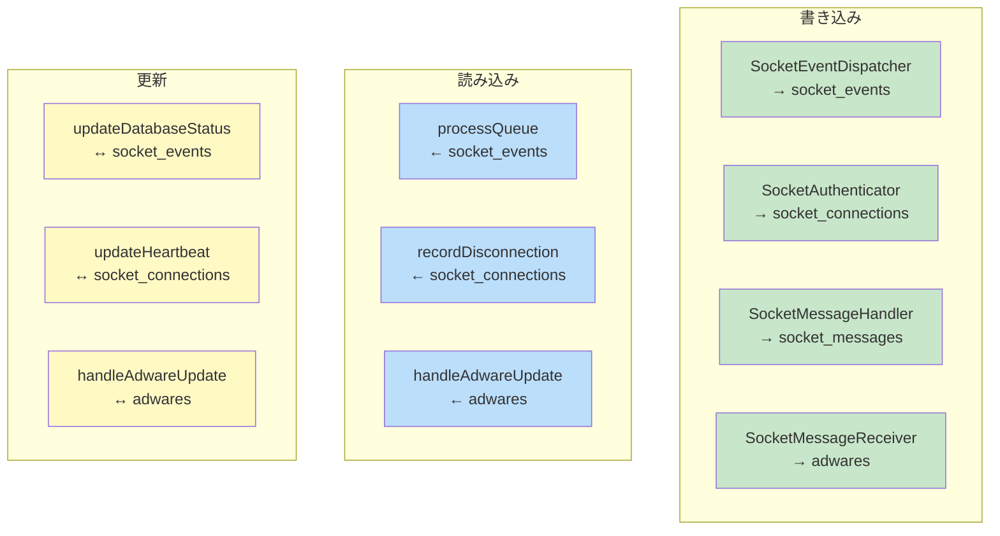
```mermaid
graph TD
    subgraph Writes["書き込み"]
        W1[SocketEventDispatcher<br/>→ socket_events]
        W2[SocketAuthenticator<br/>→ socket_connections]
        W3[SocketMessageHandler<br/>→ socket_messages]
        W4[SocketMessageReceiver<br/>→ adwares]
    end

    subgraph Reads["読み込み"]
        R1[processQueue<br/>← socket_events]
        R2[recordDisconnection<br/>← socket_connections]
        R3[handleAdwareUpdate<br/>← adwares]
    end

    subgraph Updates["更新"]
        U1[updateDatabaseStatus<br/>↔ socket_events]
        U2[updateHeartbeat<br/>↔ socket_connections]
        U3[handleAdwareUpdate<br/>↔ adwares]
    end

    style W1 fill:#c8e6c9
    style W2 fill:#c8e6c9
    style W3 fill:#c8e6c9
    style W4 fill:#c8e6c9

    style R1 fill:#bbdefb
    style R2 fill:#bbdefb
    style R3 fill:#bbdefb

    style U1 fill:#fff9c4
    style U2 fill:#fff9c4
    style U3 fill:#fff9c4
```

---

## 10. デプロイメント構成図

### オプション1: 同一サーバー配置

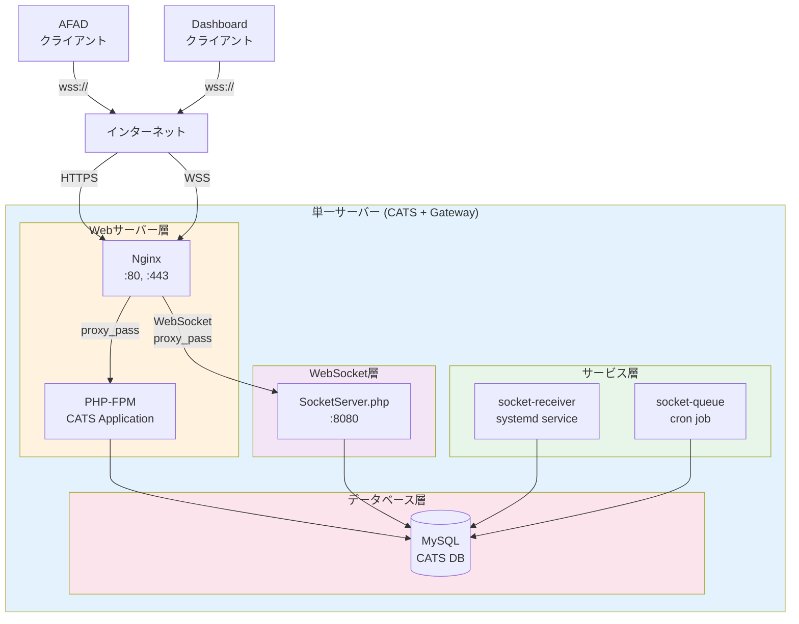
```mermaid
graph TB
    subgraph Server["単一サーバー (CATS + Gateway)"]
        subgraph Web["Webサーバー層"]
            Nginx[Nginx<br/>:80, :443]
            PHP[PHP-FPM<br/>CATS Application]
        end

        subgraph Socket["WebSocket層"]
            GW[SocketServer.php<br/>:8080]
        end

        subgraph Services["サービス層"]
            Recv[socket-receiver<br/>systemd service]
            Queue[socket-queue<br/>cron job]
        end

        subgraph DB["データベース層"]
            MySQL[(MySQL<br/>CATS DB)]
        end

        Nginx -->|proxy_pass| PHP
        Nginx -->|WebSocket<br/>proxy_pass| GW

        PHP --> MySQL
        GW --> MySQL
        Recv --> MySQL
        Queue --> MySQL
    end

    Internet[インターネット] -->|HTTPS| Nginx
    Internet -->|WSS| Nginx

    AFAD[AFAD<br/>クライアント] -->|wss://| Internet
    Dashboard[Dashboard<br/>クライアント] -->|wss://| Internet

    style Server fill:#e3f2fd
    style Web fill:#fff3e0
    style Socket fill:#f3e5f5
    style Services fill:#e8f5e9
    style DB fill:#fce4ec
```

### オプション2: 別サーバー配置

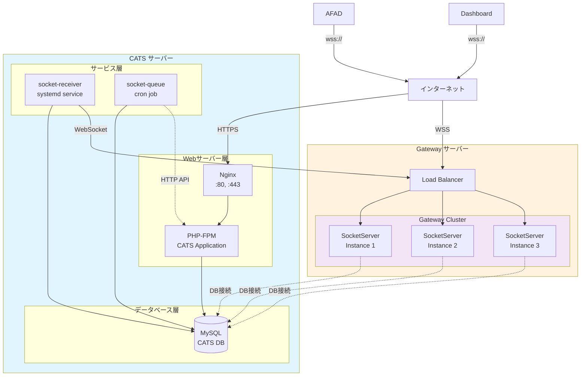
```mermaid
graph TB
    subgraph CATS_Server["CATS サーバー"]
        subgraph Web2["Webサーバー層"]
            Nginx2[Nginx<br/>:80, :443]
            PHP2[PHP-FPM<br/>CATS Application]
        end

        subgraph Services2["サービス層"]
            Recv2[socket-receiver<br/>systemd service]
            Queue2[socket-queue<br/>cron job]
        end

        subgraph DB2["データベース層"]
            MySQL2[(MySQL<br/>CATS DB)]
        end

        Nginx2 --> PHP2
        PHP2 --> MySQL2
        Recv2 --> MySQL2
        Queue2 --> MySQL2
    end

    subgraph Gateway_Server["Gateway サーバー"]
        LB[Load Balancer]

        subgraph GW_Cluster["Gateway Cluster"]
            GW1[SocketServer<br/>Instance 1]
            GW2[SocketServer<br/>Instance 2]
            GW3[SocketServer<br/>Instance 3]
        end

        LB --> GW1
        LB --> GW2
        LB --> GW3

        GW1 -.DB接続.-> MySQL2
        GW2 -.DB接続.-> MySQL2
        GW3 -.DB接続.-> MySQL2
    end

    Internet2[インターネット] -->|HTTPS| Nginx2
    Internet2 -->|WSS| LB

    Recv2 -->|WebSocket| LB
    Queue2 -.HTTP API.-> PHP2

    AFAD2[AFAD] -->|wss://| Internet2
    Dash2[Dashboard] -->|wss://| Internet2

    style CATS_Server fill:#e1f5fe
    style Gateway_Server fill:#fff3e0
    style GW_Cluster fill:#f3e5f5
```

---

## 11. シーケンス図：WebSocket接続確立

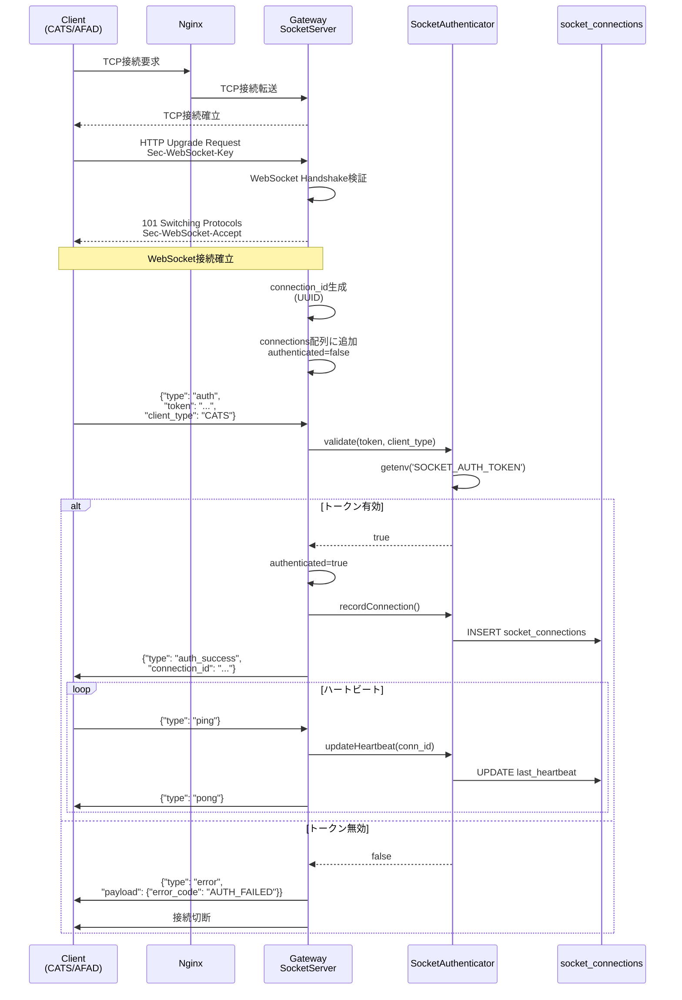
```mermaid
sequenceDiagram
    participant C as Client<br/>(CATS/AFAD)
    participant N as Nginx
    participant GW as Gateway<br/>SocketServer
    participant Auth as SocketAuthenticator
    participant DB as socket_connections

    C->>N: TCP接続要求
    N->>GW: TCP接続転送
    GW-->>C: TCP接続確立

    C->>GW: HTTP Upgrade Request<br/>Sec-WebSocket-Key
    GW->>GW: WebSocket Handshake検証
    GW-->>C: 101 Switching Protocols<br/>Sec-WebSocket-Accept

    Note over C,GW: WebSocket接続確立

    GW->>GW: connection_id生成<br/>(UUID)
    GW->>GW: connections配列に追加<br/>authenticated=false

    C->>GW: {"type": "auth",<br/> "token": "...",<br/> "client_type": "CATS"}

    GW->>Auth: validate(token, client_type)
    Auth->>Auth: getenv('SOCKET_AUTH_TOKEN')

    alt トークン有効
        Auth-->>GW: true
        GW->>GW: authenticated=true
        GW->>Auth: recordConnection()
        Auth->>DB: INSERT socket_connections
        GW->>C: {"type": "auth_success",<br/> "connection_id": "..."}

        loop ハートビート
            C->>GW: {"type": "ping"}
            GW->>Auth: updateHeartbeat(conn_id)
            Auth->>DB: UPDATE last_heartbeat
            GW->>C: {"type": "pong"}
        end

    else トークン無効
        Auth-->>GW: false
        GW->>C: {"type": "error",<br/> "payload": {"error_code": "AUTH_FAILED"}}
        GW->>C: 接続切断
    end
```

---

## 12. シーケンス図：キュー処理とリトライ

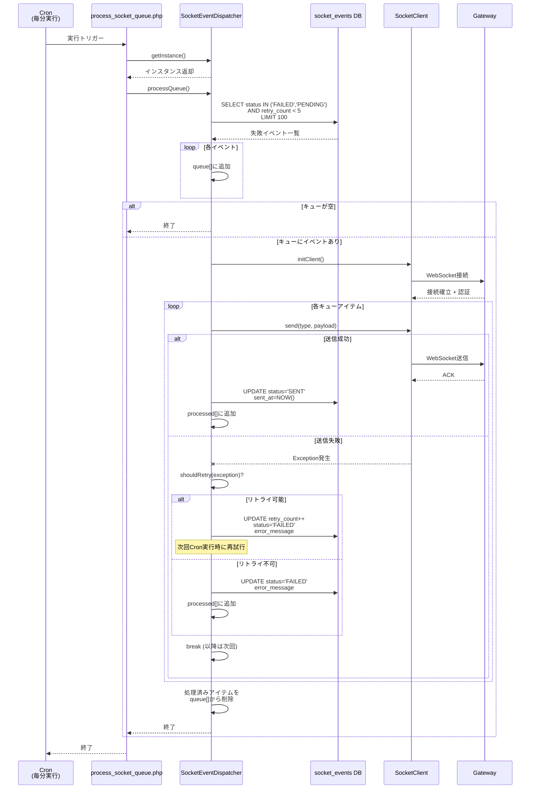
```mermaid
sequenceDiagram
    participant Cron as Cron<br/>(毎分実行)
    participant Script as process_socket_queue.php
    participant Disp as SocketEventDispatcher
    participant DB as socket_events DB
    participant Client as SocketClient
    participant GW as Gateway

    Cron->>Script: 実行トリガー
    Script->>Disp: getInstance()
    Disp-->>Script: インスタンス返却
    Script->>Disp: processQueue()

    Disp->>DB: SELECT status IN ('FAILED','PENDING')<br/>AND retry_count < 5<br/>LIMIT 100
    DB-->>Disp: 失敗イベント一覧

    loop 各イベント
        Disp->>Disp: queue[]に追加
    end

    alt キューが空
        Disp-->>Script: 終了
    else キューにイベントあり
        Disp->>Client: initClient()
        Client->>GW: WebSocket接続
        GW-->>Client: 接続確立 + 認証

        loop 各キューアイテム
            Disp->>Client: send(type, payload)

            alt 送信成功
                Client->>GW: WebSocket送信
                GW-->>Client: ACK
                Disp->>DB: UPDATE status='SENT'<br/>sent_at=NOW()
                Disp->>Disp: processed[]に追加

            else 送信失敗
                Client--xDisp: Exception発生
                Disp->>Disp: shouldRetry(exception)?

                alt リトライ可能
                    Disp->>DB: UPDATE retry_count++<br/>status='FAILED'<br/>error_message
                    Note over Disp: 次回Cron実行時に再試行

                else リトライ不可
                    Disp->>DB: UPDATE status='FAILED'<br/>error_message
                    Disp->>Disp: processed[]に追加
                end

                Disp->>Disp: break (以降は次回)
            end
        end

        Disp->>Disp: 処理済みアイテムを<br/>queue[]から削除
        Disp-->>Script: 終了
    end

    Script-->>Cron: 終了
```

---

## まとめ：可視化ドキュメントの活用方法

### 各図の用途

| 図番号 | 図の種類 | 主な用途 |
|--------|---------|---------|
| 1 | システム全体アーキテクチャ | 全体像の把握、新メンバーへの説明 |
| 2 | コンポーネント依存関係図 | 実装順序の決定、影響範囲の特定 |
| 3, 4 | データフロー図 | ビジネスロジックの理解、デバッグ |
| 5 | エラーハンドリングフロー | 例外処理の実装、テストケース設計 |
| 6, 7 | クラス図 | コーディング時の参照、リファクタリング |
| 8 | イベントタイプフロー | メッセージ種別の把握、拡張計画 |
| 9 | データベース関係図 | DB設計レビュー、パフォーマンス分析 |
| 10 | デプロイメント構成図 | インフラ構築、キャパシティプランニング |
| 11, 12 | シーケンス図 | 実装ロジックの検証、トラブルシューティング |

### レンダリング方法

#### GitHub / GitLab
- `.md` ファイルをpushすると自動でレンダリング
- Issue / PR のコメントにも貼り付け可能

#### VS Code
- 拡張機能: "Markdown Preview Mermaid Support"
- プレビューで図が表示される

#### その他ツール
- https://mermaid.live/ (オンラインエディタ)
- Notion, Obsidian (Mermaidプラグイン)
- Confluence (Mermaidマクロ)

---

**作成者:** Claude
**バージョン:** 1.0
**最終更新:** 2025-10-29
